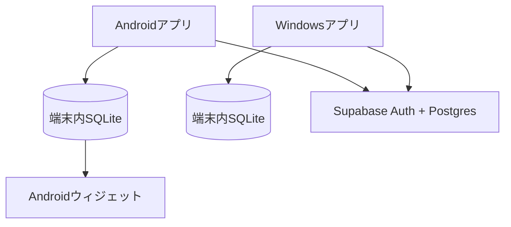

# TagMemo

Google Keepの軽快さを参考にした、Android / Windows向けのオフラインファースト・メモアプリです。Google Keepの名称・ロゴ・画面を複製するものではありません。

## MVPの機能

- タイトルと本文のメモ
- 作成日時・更新日時の表示
- Markdown編集・プレビュー（見出し、太字、箇条書き、コード）
- Markdownチェックリスト（プレビュー画面でチェック可能）
- ラベル、色、固定、検索、アーカイブ、ゴミ箱
- SQLiteへの即時保存（通信なしでも利用可能）
- Googleアカウントでログインし、Supabase経由で端末間同期
- Androidウィジェット
  - すべてのメモ
  - 固定したメモ
  - 指定ラベルのメモ
  - 背景透過度を0%・25%・50%・75%から選択
- Android APK / Windows ZIPのGitHub Actionsビルド

## 仕組み



編集は常に端末内SQLiteへ先に保存します。オンライン時だけ未同期データを送信し、他端末の更新を受信します。同じメモを複数端末で編集した場合は、MVPでは更新日時が新しい方を採用します。

## 初回セットアップ

1. Flutterをインストールする。
2. `./scripts/bootstrap.sh`（Windows PowerShellでは `./scripts/bootstrap.ps1`）を実行する。
3. Supabaseで新規プロジェクトを作り、`supabase/migrations/20260829_init.sql` を実行する。
4. Supabase AuthenticationでGoogle providerを有効にする。
5. `config/example.json` を `config/local.json` にコピーし、URLとpublishable keyを設定する。
6. 次のコマンドで起動する。

```bash
flutter run --dart-define-from-file=config/local.json
```

クラウド設定なしでも、オフライン専用アプリとして起動できます。

## Google OAuth設定

- SupabaseのRedirect URLsへ `tagmemo://login-callback` を追加します。
- Google Auth PlatformでWeb applicationのOAuth clientを作り、Supabaseのcallback URLを登録します。
- Client secretはSupabase側だけに保存し、GitHubへ入れません。
- Android manifestのカスタムスキームはbootstrap時に適用されます。
- WindowsでOAuth callbackを受け取るには、配布ZIP内の `install_tagmemo.ps1` を一度実行します。

## GitHub Actions用Secrets（任意）

- `SUPABASE_URL`
- `SUPABASE_PUBLISHABLE_KEY`

未設定でもオフライン版のビルドは成功します。

## 今後の候補

- チェックリスト、画像添付、リマインダー
- Google Keep Takeoutからのインポート
- 競合内容を比較して選ぶ画面
- メモの暗号化
